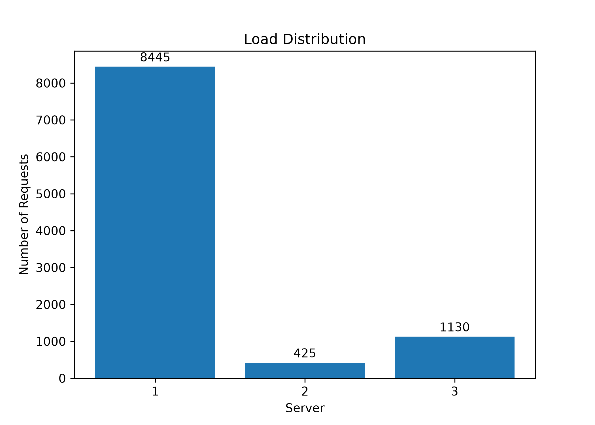
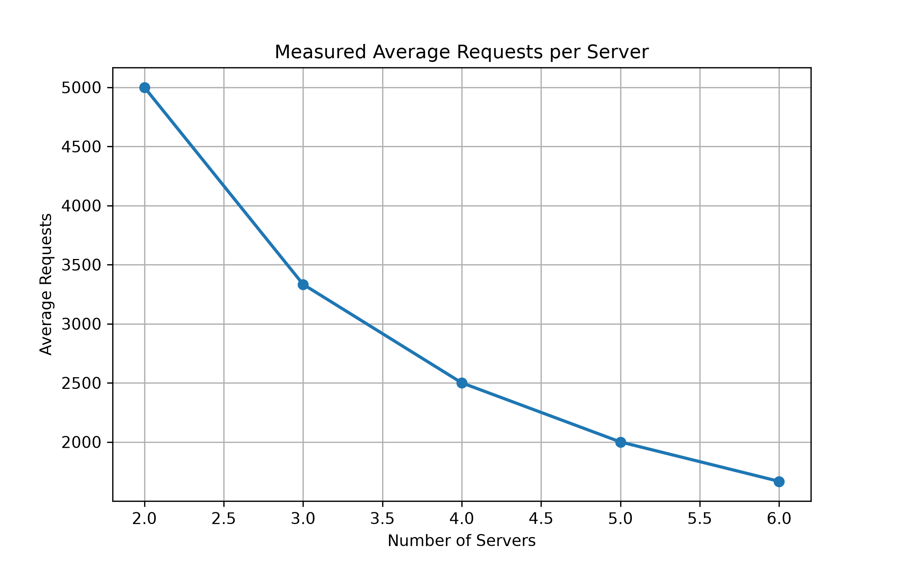
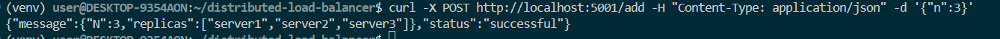
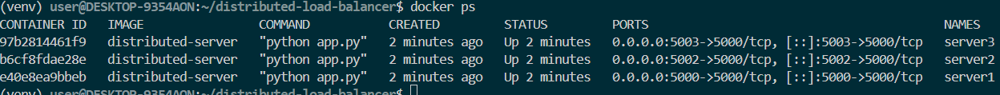
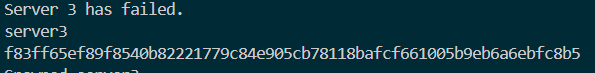
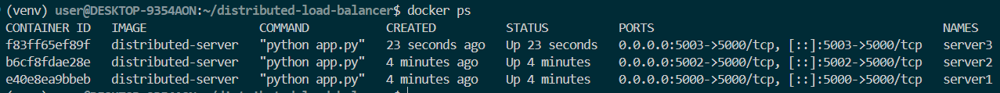
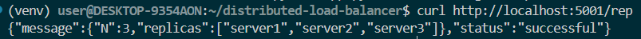
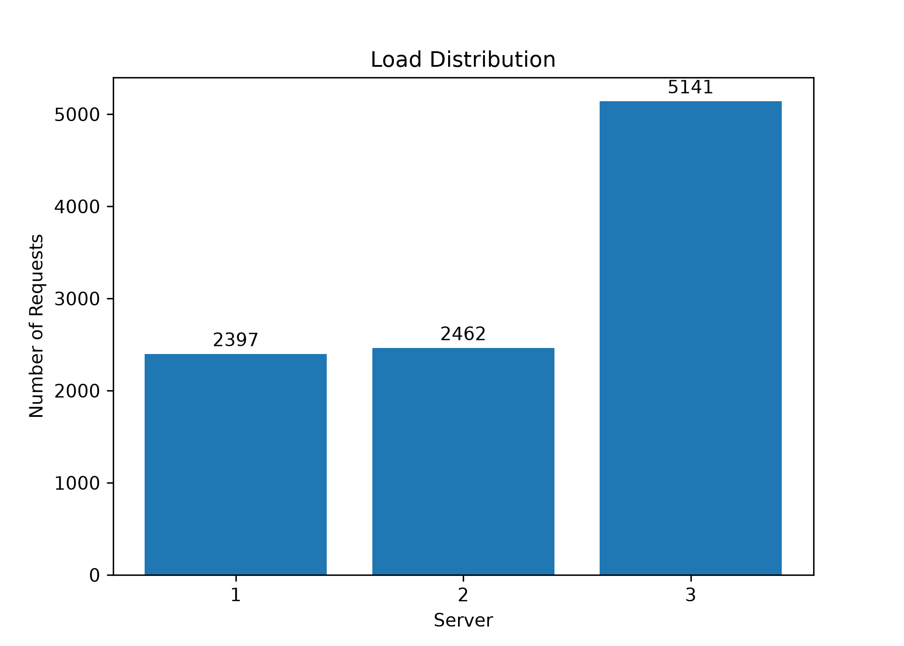

# Distributed Systems Programming Project: Distributed Load Balancer using Consistent Hashing
## Group Members
| Name              | Addmission Number |
| ----------------- | ----------------- |
| Nicole Agufana    | 169786            |
| Amy Ojuka         | 162396            |
| Ray Lukorito      | 168110            |   
| Matthew Nguithi   | 162156            |

---
# Distributed Load Balancer
## Overview
This project implements a scalable distributed load balancer using **consistent hashing** and **Docker**. The system distributes incoming client requests across multiple server replicas while supporting dynamic addition and removal of servers with minimal redistribution of requests.

The project demonstrates concepts in distributed systems, including load balancing, replica management, fault tolerance through heartbeat monitoring, and containerized deployment.

## Features
- Consistent hashing with virtual servers
- Dynamic load balancing
- Multiple server replicas
- Heartbeat monitoring for replica health
- Dynamic server addition and removal
- Docker-based deployment
- Automated unit tests

## Project Structure
```
distributed-load-balancer/
├── analysis/
├── docs/
├── hashing/
├── load_balancer/
├── server/
├── tests/
├── docker-compose.yml
├── Makefile
├── pytest.ini
├── README.md
└── requirements.txt
```

## Technologies Used
- Python 3
- Flask
- Docker
- Docker Compose
- Pytest
- Git & GitHub

## Design Choices
| **Design Choice**              | **Reason**                                                                                             |
| ------------------------------ | ------------------------------------------------------------------------------------------------------ |
| **Consistent Hashing**         | Minimizes request remapping when servers are added or removed, improving scalability.                  |
| **Flask**                      | Provides a lightweight framework for implementing the REST API.                                        |
| **Docker Containers**          | Isolates the load balancer and backend servers, creating a consistent deployment environment.          |
| **Dynamic Replica Management** | Allows servers to be added and removed at runtime through API endpoints.                               |
| **Modular Structure**          | Separates the load balancer, hashing, server, testing, and analysis components for easier maintenance. |
| **Pytest**                     | Enables automated unit and endpoint testing to verify system correctness.                              |
| **Performance Analysis**       | Uses load testing and graphs to evaluate load distribution and scalability.                            |

## Assumptions
- Backend servers are homogeneous.
- Every server can process requests equally.
- Docker is installed and running.
- Servers communicate over the Docker network.
- The hash function distributes requests uniformly.
- Failed servers are removed manually through the provided API.
- Clients communicate only with the load balancer.

## Installation
Clone the repository:
```bash
git clone https://github.com/Nckmj01/distributed-load-balancer.git
cd distributed-load-balancer
```
Create and activate a virtual environment:
```bash
python3 -m venv venv
source venv/bin/activate
```
install the project dependencies:
```bash
pip install -r requirements.txt
```

## Running the Project
```bash
make build
make up
```
## API Endpoints
| Method | Endpoint     | Purpose                 |
| ------ | ------------ | ----------------------- |
| GET    | `/rep`       | List replicas           |
| POST   | `/add`       | Add servers             |
| DELETE | `/rm`        | Remove servers          |
| GET    | `/<path>`    | Route client request    |
| GET    | `/home`      | Backend server endpoint |
| GET    | `/heartbeat` | Health check            |

## Running Tests
The project includes automated unit tests using pytest
The following files were created:
- test_hashing.py
- test_server.py
- test_load_balancer.py
- test_endpoints.py

The tests can be run using:
```bash
make unit-test
```
A total of 13 automated tests were implemented, and all tests passed successfully.

## Makefile Commands

| Command | Description |
|---------|-------------|
| `make build` | Build all Docker images |
| `make up` | Start all containers |
| `make down` | Stop and remove containers |
| `make run` | Run the load balancer locally |
| `make test` | Execute load testing |
| `make unit-test` | Run automated unit tests |

# Task 4 analysis
## Experiment A-1
### Launch 10000 async requests on N = 3 server containers and report the request count handled by each server instance in a bar chart. Explain your observations in the graph and your view on the performance.


#### Observations
- All three server replicas remained operational throughout the experiment.
- Every request was successfully handled by one of the available replicas.
- Out of 10,000 requests, Server 1 handled 8,445 requests, while Server 2 handled 425 requests and Server 3 handled 1,130 requests.
- No requests were lost during testing.

## Analysis
The requests were not distributed evenly across the three servers. Server 1 received the majority of the workload, while Servers 2 and 3 handled significantly fewer requests. This indicates that the current consistent hashing implementation resulted in an imbalanced load distribution for this experiment.

---
## A-2
### Next, increment N from 2 to 6 and launch 10000 requests on each such increment. Report the average load of the servers at each run in a line chart. Explain your observations in the graph and your view on the scalability of the load balancer implementation.
#### Number of requests on each increment
| Number of Servers | Server 2 | Server 3 | Server 4 | Server 5 | Server 6 | Server 7 | Average Load per Server |
|-------------------|---------:|---------:|---------:|---------:|---------:|---------:|------------------------:|
| 2                 |   8755   |   1225   |    —     |    —     |     —    |    —     |          5000           |
| 3                 |   8258   |   1073   |   669    |    —     |     —    |    —     |        3333.333         |
| 4                 |   8102   |   1025   |   470    |   403    |     —    |    —     |          2500           |
| 5                 |   8075   |   999    |   466    |   377    |    83    |    —     |          2000           |
| 6                 |   7980   |   299    |   910    |   426    |    394   |    81    |        1666.667         |

As the number of server replicas increased from 2 to 6, the load balancer continued to route requests successfully to the available servers.
The average load per server decreased from 5,000 requests with two servers to approximately 1,667 requests with six servers. However, although the average load per server decreased as expected, the actual request distribution remained uneven across the server replicas.
---

## A-3
### Test all endpoints of the load balancer and show that in case of server failure, the load balancer spawns a new instance quickly to handle the load.
#### We start with 3 servers


### Before Failure


#### Then Stopping one server


### After Recovery



**Observation:** The heartbeat monitoring mechanism successfully detected the failed server instance and automatically spawned a replacement container. The number of active replicas returned to the configured value, demonstrating the fault tolerance capability of the load balancer.
---

## A-4
### Finally, modify the hash functions H(i), Φ(i, j) and report the observations from (A-1) and (A-2).

| Original | Modified |
|----------|----------|
| H(i) = i² + 2i + 17 | H(i) = 131i + 17 |
| Φ(i,j) = i² + j² + 2j + 25 | Φ(i,j) = 97i + 131j + 17 |
#### Launching 10000 async requests on N = 3 server containers


*Observation:* Out of 10,000 requests, Server 1 handled 2,397 requests, Server 2 handled 2,462 requests, and Server 3 handled 5,141 requests.
*Analysis:* The modified hash function produced a more balanced distribution of requests compared to the original implementation. While Server 3 still handled a larger share of the workload, Servers 1 and 2 received a comparable number of requests, indicating that the modified hash function distributed requests more evenly across the available server replicas. This demonstrates an improvement in the load balancing performance of the consistent hashing algorithm.
#### Incrementing N from 2 to 6, to assess scalabilty
| Number of Servers | Server 2 | Server 3 | Server 4 | Server 5 | Server 6 | Server 7 | Average Load per Server |
|-------------------|---------:|---------:|---------:|---------:|---------:|---------:|------------------------:|
| 2                 |   2403   |   7597   |    —     |    —     |     —    |    —     |          5000           |
| 3                 |   2483   |   2428   |   5089   |    —     |     —    |    —     |        3333.333         |
| 4                 |   2408   |   2496   |   2411   |   2685   |     —    |    —     |          2500           |
| 5                 |   1493   |   2380   |   2405   |   2296   |   1426   |    —     |          2000           |
| 6                 |   1072   |   1448   |   2490   |   2334   |   1236   |   1420   |        1666.667         |
**Observation:** As the number of servers increased from 2 to 6, the requests were distributed across more server replicas. The workload became more balanced, with additional servers sharing the incoming requests.
**Analysis:** The results show that the load balancer scales as more servers are added. The average load per server decreased from 5,000 requests with two servers to approximately 1,667 requests with six servers, indicating that the system can distribute the workload among an increasing number of server replicas, although the distribution is not perfectly uniform.
### Comparison of the hash functions
- The modified hash functions produced a more balanced distribution of requests than the original hash functions.
- The original implementation concentrated most requests on a single server, resulting in poor load balancing.
- The modified implementation distributed requests more evenly as additional servers were added, demonstrating improved scalability.
- The use of prime-number coefficients (97 and 131) helped spread request and virtual server hashes more uniformly across the hash ring, reducing clustering.
- Overall, the modified hash functions provided better load balancing and more efficient utilization of server replicas.
---
---

## Conclusion
The distributed load balancer successfully demonstrated dynamic request routing using consistent hashing, runtime server management, automated failure recovery, and scalability through Dockerized backend replicas. Performance testing showed that modifying the hash functions improved request distribution and overall load balancing efficiency.
